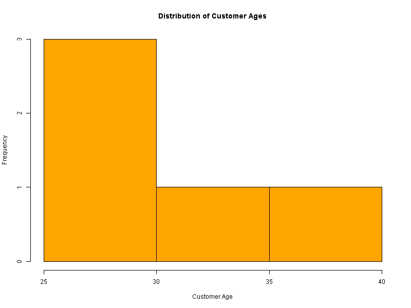
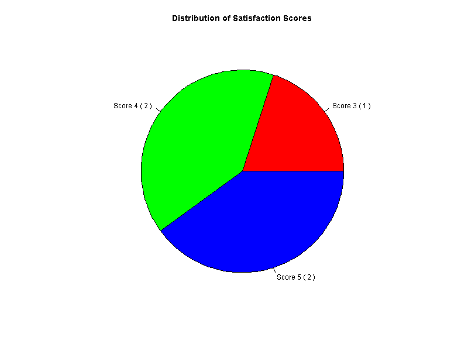
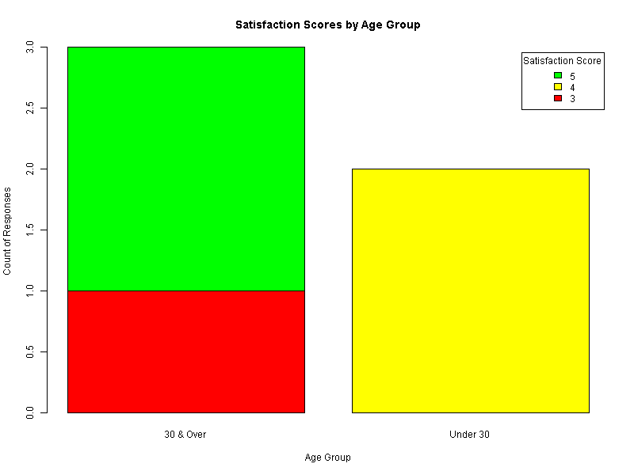
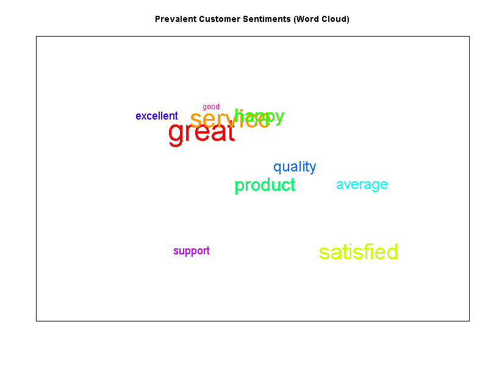
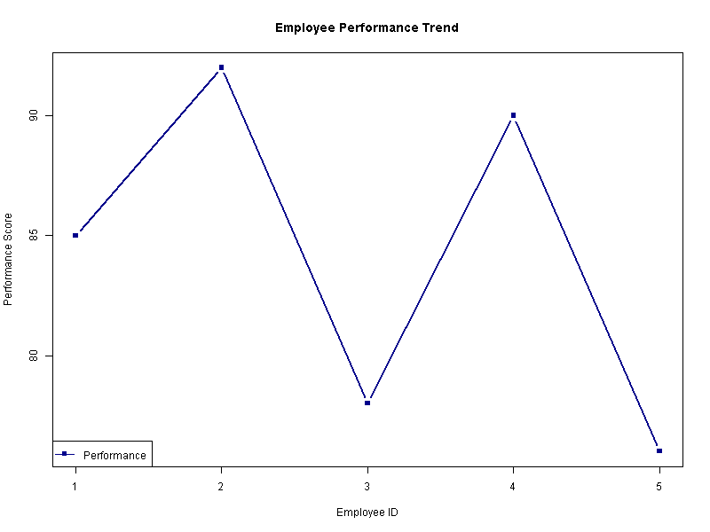
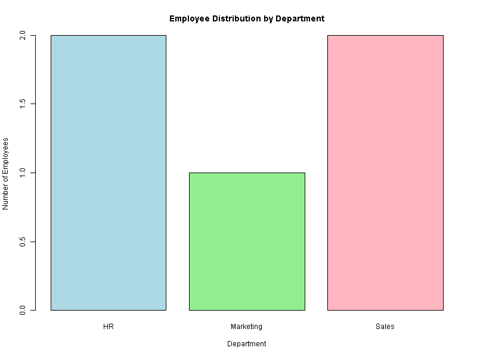
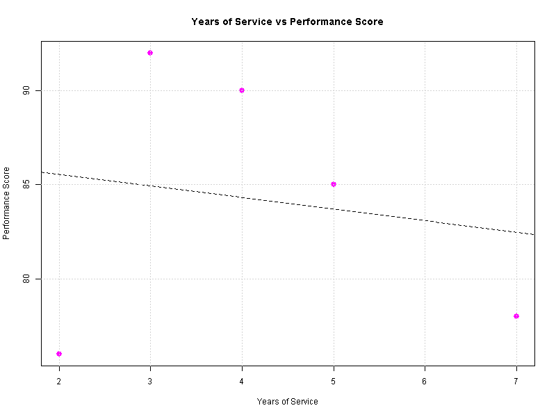
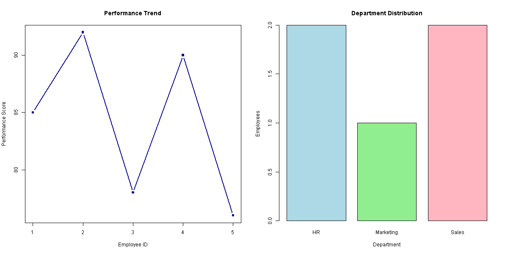

<div align="center">

  # 📊 Data Handling & Visualization with R

  **A structured repository for practical data wrangling, exploratory data analysis, and advanced statistical visualizations.**

  <sub>Developed & Maintained by</sub><br>
  ### 👤 [SYED THOUQEER AHMED A](https://github.com/thouqeer-07)

  <br>

  [](https://www.r-project.org/)
  [](LICENSE)
  [](CONTRIBUTING.md)
  [](#-experiments-index)

  <br>

  [Features](#-key-features) •
  [Gallery](#-visual-gallery) •
  [Repository Structure](#-repository-structure) •
  [Quick Start](#-quick-start) •
  [Packages Used](#-core-r-packages)

</div>

---

---

## 📌 Overview

Welcome to the **Data Handling & Visualization with R** repository! This project serves as an organized workspace containing practical implementations, data wrangling pipelines, statistical experiments, and publication-ready graphics.

All practical modules in this repository align with the official lab guidelines outlined in [`List of Experiments_DSA06.pdf`](./List%20of%20Experiments_DSA06.pdf).

---

## ✨ Key Features

* 📁 **Data Wrangling:** Clean workflows using `tidyverse` and `data.table` for subsetting, merging, reshaping, and imputing raw data.
* 📈 **Publication-Quality Visuals:** Custom-themed `ggplot2` charts including scatter plots, distribution plots, box plots, heatmaps, and faceted grids.
* 🕹️ **Interactive Graphics:** Dynamic plots rendered using packages such as `plotly` and `highcharter`.
* 📑 **Documented Experiments:** Step-by-step experiment files with detailed descriptions, input datasets, and resulting output charts.

---

## 🖼️ Visual Gallery

Below is a showcase preview of sample visualization outputs generated by the R scripts in this repository:

### 📊 Distribution & Categorical Analysis

| 📊 Histogram | 🥧 Pie Chart |
| :---: | :---: |
|  |  |
| *`outputs/exp2_q1_histogram.png`* | *`outputs/exp2_q2_pie_chart.png`* |

| 📊 Stacked Bar Chart | ☁️ Wordcloud |
| :---: | :---: |
|  |  |
| *`outputs/exp2_q3_stacked_bar.png`* | *`outputs/exp2_q4_wordcloud.png`* |

---

### 📈 Advanced Trends & Dashboard Layouts

| 📈 Line Chart | 📊 Bar Chart |
| :---: | :---: |
|  |  |
| *`outputs/exp3_q1_line_chart.png`* | *`outputs/exp3_q2_bar_chart.png`* |

| 📉 Scatter Plot | 🖥️ Dashboard Simulation |
| :---: | :---: |
|  |  |
| *`outputs/exp3_q3_scatter_plot.png`* | *`outputs/exp3_q4_dashboard_simulation.png`* |

---

## 📂 Repository Structure

```text
.
├── 📁 data/                           # Raw and processed datasets (.csv, .xlsx, .rds)
├── 📁 experiments/                    # R scripts for each experiment (DSA06)
│   ├── exp_01_data_cleaning.R
│   ├── exp_02_data_wrangling.R
│   └── exp_03_visualizations.R
├── 📁 outputs/                        # High-res exports (Plots, PDF reports, HTML files)
│   ├── plot_01.png
│   └── plot_02.png
├── 📄 List of Experiments_DSA06.pdf   # Official course/experiment checklist & instructions
└── 📄 README.md                       # Project documentation
